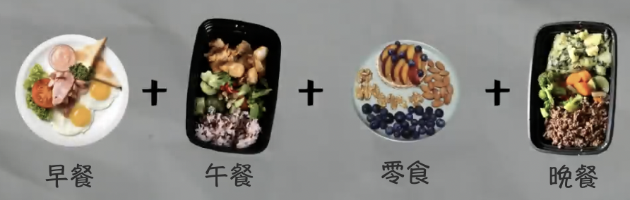

## 减脂备餐

[TOC]

### 规划摄入

每日碳水：2g~3g/公斤体重。`1g碳水=4kcal`

每日蛋白质：1.5g~2.2g/公斤体重。`1g蛋白质=4kcal`

每日脂肪：1g/公斤体重。`1g脂肪=9kcal`

<small>易胖体质：碳水可以少一点。有运动健身习惯：碳水、蛋白质可以多一点。</small>

| 体重 |   碳水    |   蛋白质    | 脂肪 |
| :--: | :-------: | :---------: | :--: |
| 95kg | 190g~285g | 142.5g~209g | 95g  |
| 90kg | 180g~270g |  135g~198g  | 90g  |
| 85kg | 170g~255g | 127.5g~187g | 85g  |
| 80kg | 160g~240g |  120g~176g  | 80g  |
| 75kg | 150g~225g | 112.5g~165g | 75g  |
| 70kg | 140g~210g |  105g~154g  | 70g  |
| 65kg | 130g~195g | 97.5g~143g  | 65g  |
| 60kg | 120g~180g |  90g~132g   | 60g  |

> | 减脂周期 |  每周减脂   |
> | :------: | :---------: |
> |  1-3周   |  0.5kg~1kg  |
> |  4-10周  |  0.5kg左右  |
> | 10周以后 | 0.2kg~0.5kg |

### 营养含量

| 食材<small>（每100g含量）</small> |  碳水 | 蛋白质 | 脂肪 |  总热量 |
| :-------------------------------: | ----: | -----: | ---: | ------: |
|               鸡胸                |  2.5g |  19.4g |   3g | 115kcal |
| 鸡腿肉<small>（去皮去骨）</small> |    0g |    20g | 7.2g | 145kcal |
|              牛肉馅               |  2.7g |  16.6g | 6.5g | 136kcal |
|               大米                |   77g |   7.9g | 0.9g | 348kcal |
|               土豆                | 17.8g |   2.6g |   0g |  81kcal |
|               红薯                |   20g |   1.6g |   0g |  86kcal |

<small>除了土豆和红薯，其他的蔬菜都不需要计算。</small>

### 热量缺口

|   体重   | 摄入碳水<small>（2g/kg）</small> | 摄入蛋白质<small>（2g/kg）</small> | 摄入脂肪<small>（1g/kg）</small> |  摄入总热量  |
| :------: | :------------------------------: | :--------------------------------: | :------------------------------: | :----------: |
| **95kg** |             **190g**             |              **190g**              |             **95g**              | **2375kcal** |

要保证每日`热量赤字`达到`500kcal`，则每日`消耗总热量`就要达到`2875kcal`。

减去`基础代谢`部分的`1895kcal`，则每日还需要通过`运动消耗`热量`980kcal`。

> 基础代谢：
>
> <small>$男=10\times体重 (kg)+6.25\times身高 (cm)-5\times年龄+5$</small>
> <small>$女=10\times体重 (kg)+6.25\times身高 (cm)-5\times年龄-161$</small>

### 饮食分配

 

摄入总热量`2375kcal`需减去每日`早餐`和`零食`热量（约占<small>$1/3$</small>）。

每日`午餐`和`晚餐`供应的热量应为：<small>$2375kcal\times\frac{2}{3}=1580kcal$</small>。

每份备餐的热量应为：<small>$1583kcal\times\frac{1}{2}=790kcal$​</small>。

每日摄入`190g`碳水和`190g`蛋白质，<small>$190g\times\frac{1}{3}=65g$</small>。

> 结论：**每餐热量`790kcal`，保证`65g`碳水和`65g`蛋白质的供应**。

### 备餐流程

备餐日当晚做饭，需一次性准备6份便当。

当晚吃掉1份，冷藏2份，冷冻3份。

次日吃掉2份，冷冻转冷藏2份。

次日吃掉2份，冷冻转冷藏1份。

次日吃掉1份，当日即备餐日，循环往复。

> 备餐日，即剩余便当份数<small>$\leq1$​</small>的那一天。

### 食材清单

碳水<small>（3种来源）</small>：米饭，土豆泥，红薯。

蛋白质<small>（3种来源）</small>：黑椒鸡胸，奥尔良鸡腿，照烧牛肉。

蔬菜：随意种类、分量自选。

> |   食材 | 未知重量                                                     | 计算重量                              |
> | -----: | :----------------------------------------------------------- | ------------------------------------- |
> | 鸡胸肉 | $x$g                                                         | 480g                                  |
> | 鸡腿肉 | $\frac{4}{3}x$g<small>（去皮去骨约$x$g）</small> | 640g<small>（去皮去骨约480g）</small> |
> | 牛肉馅 | $x$g                                          | 480g                                  |
> |   大米 | $y$g                                          | 240g                                  |
> |   土豆 | $x$g                                          | 480g                                  |
> |   红薯 | $x$g                                          | 480g                                  |
> |   蔬菜 | 略                                                           | 略                                    |
>
> 食材总热量：
>
> <small>$790\times6\times\frac{3}{4}=3555$</small>（保留蔬菜作为$\frac{1}{4}$的热量供应）
>
> <small>$3555=(1.15+1.45+1.36)x+3.48y+(0.81+0.86)x$</small>
>
> 令<small>$x=2y$</small>，则<small>$3555=14.74y$</small>，解得<small>$x=480$</small>，<small>$y=240$​</small>

### 烹饪制作

1. 鸡胸肉切块，加橄榄油、黑胡椒酱、盐、黑胡椒粉、十三香<small>（五香粉）</small>、生抽，抓匀、腌制。

   鸡腿肉去皮去骨，切出需重鸡腿肉。

   加水稀释奥尔良腌料粉<small>（水:粉:肉的重量比为1:1:20）</small>，加盐、生抽，抓匀、腌制。

2. 蒸米饭<small>（可以混合黑米或糙米）</small>。重量以生米称重为准。

   土豆去皮切块，锅中加水没过土豆，以制备土豆泥。

   红薯切厚片，同锅上屉在盘中蒸熟。

   水开后转小火，20分钟后即可关火。

3. 配料处理：洋葱切碎丁，小辣椒切段，大蒜切大片，生姜磨末。

   调制照烧汁：蜂蜜:酱油=1:1，加点辣椒面、芝麻油、黑胡椒。

4. 锅中一点底油，倒鸡胸炒至变色加水少许，盖上盖子转中小火，等3分钟后出锅。

   锅中一点底油，倒洋葱碎爆香，倒鸡腿肉，炒至变色加水加盖，3-5分钟后出锅。

   锅中一点底油，倒洋葱碎爆香，倒牛肉馅，加姜末、照烧汁，加盖3分钟后出锅。

5. 蔬菜处理：切小块，锅中一点底油，煎制，加糖、黑胡椒粉，加盖3分钟后出锅。

   西蓝花切小朵，锅中放小块儿黄油，将小米椒、蒜片爆香，炒西蓝花，加糖少许。

6. 土豆泥：菠菜切小碎叶，锅中一点底油，爆香蒜片。

   放入菠菜翻炒，挑出蒜片，倒入土豆捣碎，加黄油、盐、黑胡椒粉调味，压成泥。

7. 分装：午餐都吃米饭，晚餐吃土豆泥或者红薯（也可以一半一半混装）。

   主食平均分好以后，再往每个盒子里，放一份蔬菜、一份肉，3种肉每种都平均分成2份。
